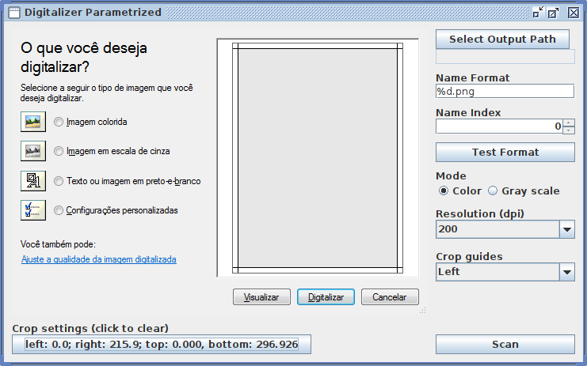

# Digitalizer Parametrized using SANE

This is the Linux version of [my other project for Windows](https://github.com/GuiRitter/DigitalizerParametrized). That one uses WIA, this one uses SANE.

You might be wondering why there's a screenshot of the WIA interface in the Linux version. The reason is because I physically painted my printer with guides that correspond to the WIA interface in order to make a quick and dirty crop.

At least I finally have the option to set the scan area, color space and DPI before scanning. This means that I only need one button press to scan and that the setup gets reused if I have no need to change it between scans.

A lot has been hardcoded for my needs because I needed this up and running as soon as possible. Sorry.

[A few words about Maven.](https://gist.github.com/GuiRitter/1834bd024756e08ab422026a7cd24605)
